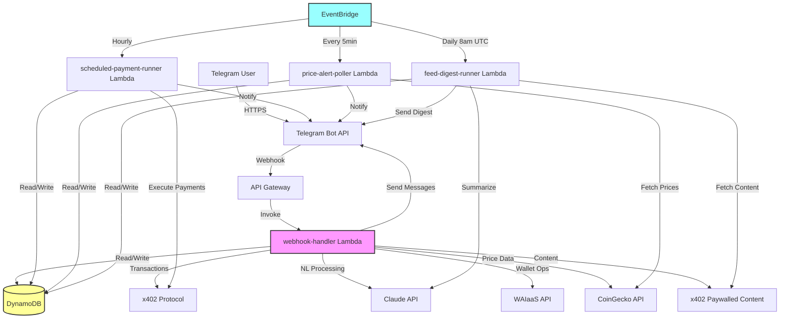
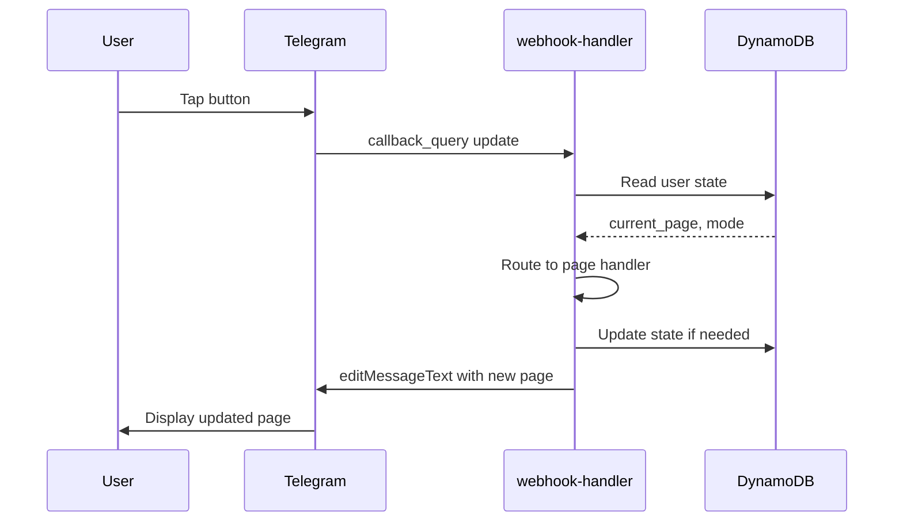
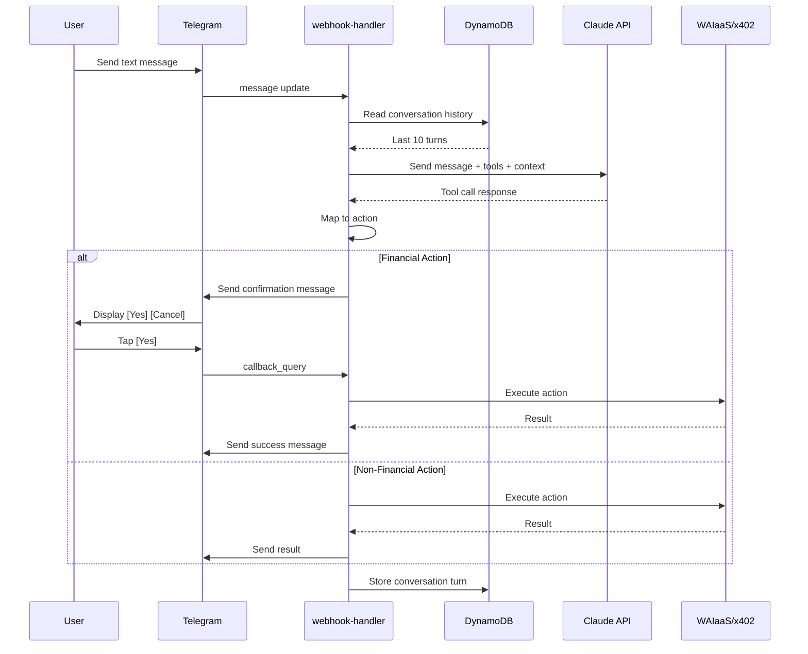
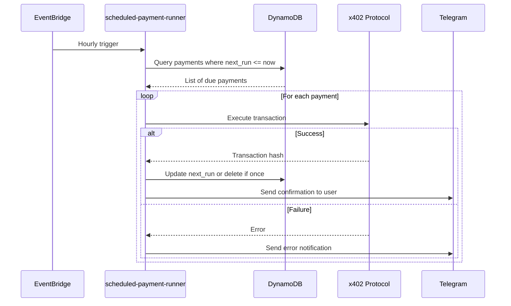

# Technical Design Document

## Overview

The Telegram AI Finance Bot is a serverless application built on AWS infrastructure that provides users with a conversational AI-powered interface for managing cryptocurrency wallets, executing blockchain transactions, and accessing paywalled content. The system integrates multiple external services including Telegram Bot API, Anthropic Claude API, WAIaaS (Wallet-as-a-Service), x402 payment protocol on Base blockchain, and CoinGecko price data API.

### System Goals

- **Dual Interaction Modes**: Support both paginated menu navigation and natural language command processing
- **Wallet Management**: Provide secure, agent-managed cryptocurrency wallets via WAIaaS
- **Financial Operations**: Enable sending, receiving, swapping, and investing in digital assets
- **Automation**: Support scheduled payments, price alerts, and content feed digests
- **Content Access**: Enable micropayment-based access to paywalled articles via x402 protocol
- **Scalability**: Leverage serverless architecture for automatic scaling and cost efficiency

### Key Design Principles

1. **Stateless Lambda Functions**: All Lambda functions are stateless, with state persisted in DynamoDB
2. **Event-Driven Architecture**: Use EventBridge for scheduled tasks and asynchronous processing
3. **Confirmation Flows**: Require explicit user confirmation for all financial actions
4. **Graceful Degradation**: Handle external API failures without breaking core functionality
5. **Security First**: Never expose private keys directly; use WAIaaS for key management

## Architecture

### High-Level Architecture Diagram



### Component Overview

#### Core Components

1. **webhook-handler Lambda**: Main entry point for all Telegram updates
2. **scheduled-payment-runner Lambda**: Executes scheduled payments on schedule
3. **price-alert-poller Lambda**: Monitors asset prices and triggers alerts
4. **feed-digest-runner Lambda**: Fetches and summarizes content from subscribed feeds
5. **DynamoDB Table**: Persistent storage for user state, contacts, alerts, subscriptions
6. **API Gateway**: HTTPS endpoint for Telegram webhook
7. **EventBridge Rules**: Scheduled triggers for background Lambda functions

#### External Services

1. **Telegram Bot API**: Message delivery and inline keyboard interactions
2. **Claude API**: Natural language understanding and tool calling
3. **WAIaaS**: Wallet creation, balance queries, transaction signing
4. **x402 Protocol**: Blockchain transactions on Base network
5. **CoinGecko API**: Real-time cryptocurrency price data
6. **x402 Paywalled Content**: Micropayment-gated article access

### Data Flow Patterns

#### Menu Mode Interaction Flow



#### Natural Language Mode Interaction Flow



#### Scheduled Payment Execution Flow



## Components and Interfaces

### webhook-handler Lambda

**Purpose**: Process all incoming Telegram updates and route to appropriate handlers

**Trigger**: API Gateway POST request from Telegram webhook

**Environment Variables**:
- `TELEGRAM_TOKEN`: Bot authentication token
- `ANTHROPIC_API_KEY`: Claude API key
- `WAAIAS_API_KEY`: WAIaaS authentication key
- `X402_PRIVATE_KEY`: Private key for x402 transactions
- `DYNAMODB_TABLE`: Table name for state storage
- `AWS_REGION`: AWS region for DynamoDB
- `COINGECKO_API_KEY`: CoinGecko API key

**Module Structure**:

```
webhook-handler/
├── handler.py              # Main Lambda entry point
├── pages/
│   ├── __init__.py
│   ├── page0.py           # Wallet operations page
│   ├── page1.py           # Contacts and payments page
│   ├── page2.py           # Investments and alerts page
│   ├── page3.py           # Content access page
│   └── page4.py           # Settings page
├── nl_mode/
│   ├── __init__.py
│   ├── processor.py       # Claude API integration
│   ├── tools.py           # Tool definitions for Claude
│   └── confirmation.py    # Confirmation flow handler
├── wallet/
│   ├── __init__.py
│   ├── waaias_client.py   # WAIaaS API client
│   └── x402_client.py     # x402 protocol client
├── db/
│   ├── __init__.py
│   ├── user_state.py      # User state operations
│   ├── contacts.py        # Contact CRUD operations
│   ├── alerts.py          # Price alert operations
│   └── subscriptions.py   # Feed subscription operations
├── utils/
│   ├── __init__.py
│   ├── telegram.py        # Telegram API helpers
│   ├── validation.py      # Input validation
│   └── formatting.py      # Message formatting
└── requirements.txt
```

**Key Interfaces**:

```python
# handler.py
def lambda_handler(event, context):
    """
    Main entry point for webhook updates
    
    Args:
        event: API Gateway event containing Telegram update
        context: Lambda context
        
    Returns:
        dict: API Gateway response with statusCode 200
    """
    pass

# pages/page0.py
def handle_page0_action(user_id: str, action: str, telegram_client, db_client):
    """
    Handle actions on Page 0 (Wallet Operations)
    
    Args:
        user_id: Telegram user ID
        action: Button action identifier
        telegram_client: Telegram API client
        db_client: DynamoDB client
        
    Returns:
        None (sends message via telegram_client)
    """
    pass

# nl_mode/processor.py
def process_nl_message(user_id: str, message: str, conversation_history: list):
    """
    Process natural language message via Claude API
    
    Args:
        user_id: Telegram user ID
        message: User's text message
        conversation_history: Last 10 conversation turns
        
    Returns:
        dict: Claude response with tool calls or text
    """
    pass

# wallet/waaias_client.py
class WAIaaSClient:
    def create_wallet(self, user_id: str) -> str:
        """Create new wallet and return address"""
        pass
    
    def get_balance(self, address: str, token: str) -> float:
        """Get token balance for address"""
        pass
    
    def get_transactions(self, address: str, limit: int) -> list:
        """Get transaction history"""
        pass

# wallet/x402_client.py
class X402Client:
    def send_transaction(self, from_addr: str, to_addr: str, amount: float, token: str) -> str:
        """Execute transaction and return tx hash"""
        pass
    
    def swap_tokens(self, from_token: str, to_token: str, amount: float) -> str:
        """Execute token swap and return tx hash"""
        pass
    
    def fetch_paywalled_content(self, url: str) -> str:
        """Pay x402 micropayment and retrieve content"""
        pass
```

### scheduled-payment-runner Lambda

**Purpose**: Execute scheduled payments at their designated times

**Trigger**: EventBridge rule (hourly)

**Environment Variables**: Same as webhook-handler

**Module Structure**:

```
scheduled-payment-runner/
├── handler.py              # Main Lambda entry point
├── payment_executor.py     # Payment execution logic
├── wallet/
│   └── x402_client.py     # Shared x402 client
├── db/
│   └── scheduled_payments.py  # Payment CRUD operations
└── requirements.txt
```

**Key Interfaces**:

```python
def lambda_handler(event, context):
    """
    Query and execute due scheduled payments
    
    Args:
        event: EventBridge event
        context: Lambda context
        
    Returns:
        dict: Execution summary with success/failure counts
    """
    pass

def execute_payment(payment: dict) -> tuple[bool, str]:
    """
    Execute a single scheduled payment
    
    Args:
        payment: Payment record from DynamoDB
        
    Returns:
        tuple: (success: bool, result: str)
    """
    pass

def update_next_run(payment_id: str, recurrence: str):
    """
    Calculate and update next_run timestamp
    
    Args:
        payment_id: Unique payment identifier
        recurrence: "once", "daily", "weekly", or "monthly"
    """
    pass
```

### price-alert-poller Lambda

**Purpose**: Monitor asset prices and trigger alerts when thresholds are met

**Trigger**: EventBridge rule (every 5 minutes)

**Environment Variables**: Same as webhook-handler

**Module Structure**:

```
price-alert-poller/
├── handler.py              # Main Lambda entry point
├── price_checker.py        # Price comparison logic
├── coingecko_client.py     # CoinGecko API client
├── db/
│   └── alerts.py          # Alert CRUD operations
└── requirements.txt
```

**Key Interfaces**:

```python
def lambda_handler(event, context):
    """
    Check all active price alerts
    
    Args:
        event: EventBridge event
        context: Lambda context
        
    Returns:
        dict: Summary with triggered alert count
    """
    pass

def check_alert(alert: dict, current_price: float) -> bool:
    """
    Determine if alert should trigger
    
    Args:
        alert: Alert record with target_price and direction
        current_price: Current asset price
        
    Returns:
        bool: True if alert should trigger
    """
    pass

class CoinGeckoClient:
    def get_price(self, asset_symbol: str) -> float:
        """Fetch current price for asset"""
        pass
    
    def get_24h_change(self, asset_symbol: str) -> float:
        """Fetch 24-hour price change percentage"""
        pass
```

### feed-digest-runner Lambda

**Purpose**: Fetch new content from subscribed feeds and send AI-generated summaries

**Trigger**: EventBridge rule (daily at 8am UTC)

**Environment Variables**: Same as webhook-handler

**Module Structure**:

```
feed-digest-runner/
├── handler.py              # Main Lambda entry point
├── feed_fetcher.py         # RSS/newsletter fetching
├── content_summarizer.py   # Claude API summarization
├── wallet/
│   └── x402_client.py     # For paywalled content
├── db/
│   └── subscriptions.py   # Subscription CRUD operations
└── requirements.txt
```

**Key Interfaces**:

```python
def lambda_handler(event, context):
    """
    Process all feed subscriptions
    
    Args:
        event: EventBridge event
        context: Lambda context
        
    Returns:
        dict: Summary with processed feed count
    """
    pass

def fetch_feed_content(feed_url: str, last_fetched: int) -> list:
    """
    Fetch new content since last_fetched timestamp
    
    Args:
        feed_url: RSS or newsletter URL
        last_fetched: Unix timestamp of last fetch
        
    Returns:
        list: New content items
    """
    pass

def summarize_content(content_items: list) -> str:
    """
    Generate AI summary of content items
    
    Args:
        content_items: List of content to summarize
        
    Returns:
        str: Formatted summary text
    """
    pass
```

### Shared Modules

#### db Module

Provides abstraction layer for DynamoDB operations:

```python
class UserStateDB:
    def get_user(self, user_id: str) -> dict:
        """Retrieve user state"""
        pass
    
    def update_user(self, user_id: str, updates: dict):
        """Update user state fields"""
        pass
    
    def create_user(self, user_id: str, wallet_address: str):
        """Initialize new user record"""
        pass

class ContactsDB:
    def add_contact(self, user_id: str, name: str, address: str) -> str:
        """Add contact and return contact_id"""
        pass
    
    def get_contacts(self, user_id: str) -> list:
        """Retrieve all contacts for user"""
        pass
    
    def remove_contact(self, user_id: str, contact_id: str):
        """Delete contact"""
        pass

class AlertsDB:
    def create_alert(self, user_id: str, asset: str, target_price: float, direction: str) -> str:
        """Create price alert and return alert_id"""
        pass
    
    def get_alerts(self, user_id: str) -> list:
        """Retrieve all alerts for user"""
        pass
    
    def get_all_active_alerts(self) -> list:
        """Retrieve all active alerts across all users"""
        pass
    
    def delete_alert(self, alert_id: str):
        """Delete alert"""
        pass

class ScheduledPaymentsDB:
    def create_payment(self, user_id: str, contact_id: str, amount: float, 
                      currency: str, recurrence: str, next_run: int) -> str:
        """Create scheduled payment and return payment_id"""
        pass
    
    def get_payments(self, user_id: str) -> list:
        """Retrieve all scheduled payments for user"""
        pass
    
    def get_due_payments(self) -> list:
        """Retrieve all payments where next_run <= now"""
        pass
    
    def update_next_run(self, payment_id: str, next_run: int):
        """Update next execution time"""
        pass
    
    def delete_payment(self, payment_id: str):
        """Delete scheduled payment"""
        pass

class SubscriptionsDB:
    def create_subscription(self, user_id: str, feed_url: str) -> str:
        """Create feed subscription and return subscription_id"""
        pass
    
    def get_subscriptions(self, user_id: str) -> list:
        """Retrieve all subscriptions for user"""
        pass
    
    def get_all_subscriptions(self) -> list:
        """Retrieve all subscriptions across all users"""
        pass
    
    def update_last_fetched(self, subscription_id: str, timestamp: int):
        """Update last fetch timestamp"""
        pass
    
    def delete_subscription(self, subscription_id: str):
        """Delete subscription"""
        pass
```

## Data Models

### DynamoDB Table Schema

**Table Name**: `telegram-finance-bot-users`

**Primary Key**: `telegram_user_id` (String, Partition Key)

**Attributes**:

```python
{
    "telegram_user_id": "123456789",  # Partition key
    "wallet_address": "0xabc...",
    "current_page": 0,
    "interaction_mode": "menu",  # "menu" or "nl"
    "network": "base-mainnet",  # "base-mainnet", "base-sepolia", "optimism"
    "notification_prefs": {
        "price_alerts": True,
        "scheduled_payments": True,
        "feed_digests": True
    },
    "nl_conversation_history": [
        {"role": "user", "content": "what's my balance"},
        {"role": "assistant", "content": "You have 0.5 ETH..."}
    ],
    "contacts": [
        {
            "contact_id": "uuid-1",
            "name": "Marcus",
            "address": "0xdef..."
        }
    ],
    "scheduled_payments": [
        {
            "payment_id": "uuid-2",
            "contact_id": "uuid-1",
            "amount": 10.0,
            "currency": "USDC",
            "recurrence": "weekly",  # "once", "daily", "weekly", "monthly"
            "next_run": 1704067200  # Unix timestamp
        }
    ],
    "price_alerts": [
        {
            "alert_id": "uuid-3",
            "asset_symbol": "BTC",
            "target_price": 100000.0,
            "direction": "above"  # "above" or "below"
        }
    ],
    "feed_subscriptions": [
        {
            "subscription_id": "uuid-4",
            "feed_url": "https://example.com/rss",
            "last_fetched": 1704000000  # Unix timestamp
        }
    ],
    "created_at": 1704000000,
    "updated_at": 1704067200
}
```

**Access Patterns**:

1. **Get user by telegram_user_id**: Direct partition key lookup
2. **Get all due scheduled payments**: Scan with filter on `next_run <= now` (used by scheduled-payment-runner)
3. **Get all active price alerts**: Scan (used by price-alert-poller)
4. **Get all feed subscriptions**: Scan (used by feed-digest-runner)

**Optimization Considerations**:

- For production scale, consider using Global Secondary Indexes (GSI) for scan operations:
  - GSI on `next_run` for scheduled payments
  - Separate table for alerts with GSI on `asset_symbol`
  - Separate table for subscriptions

### Configuration Object

**Purpose**: Parse and validate environment variables and configuration files

**Structure**:

```python
@dataclass
class Configuration:
    telegram_token: str
    anthropic_api_key: str
    waaias_api_key: str
    x402_private_key: str
    dynamodb_table: str
    aws_region: str
    coingecko_api_key: str
    
    @classmethod
    def from_env(cls) -> 'Configuration':
        """Load configuration from environment variables"""
        pass
    
    @classmethod
    def from_file(cls, filepath: str) -> 'Configuration':
        """Parse configuration from file"""
        pass
    
    def validate(self) -> list[str]:
        """
        Validate configuration values
        
        Returns:
            list: Validation errors (empty if valid)
        """
        pass
    
    def to_file(self, filepath: str):
        """Write configuration to file"""
        pass
```

### Page State Machine

**Purpose**: Define valid page transitions and button actions

**States**: Pages 0-4

**Transitions**:

```python
PAGE_DEFINITIONS = {
    0: {
        "title": "💰 Wallet Operations",
        "buttons": [
            [{"text": "💰 View Balance", "action": "view_balance"}],
            [{"text": "📋 Transaction History", "action": "tx_history"}],
            [{"text": "➕ Add Funds", "action": "add_funds"}],
            [{"text": "➖ Withdraw Funds", "action": "withdraw"}],
            [{"text": "🔄 Swap Tokens", "action": "swap"}],
            [{"text": "← Back", "action": "prev_page"}, 
             {"text": "→ Next", "action": "next_page"}],
            [{"text": "🧠 AI Mode", "action": "switch_to_nl"}]
        ]
    },
    1: {
        "title": "👥 Contacts & Payments",
        "buttons": [
            [{"text": "➕ Add Contact", "action": "add_contact"}],
            [{"text": "👥 View Contacts", "action": "view_contacts"}],
            [{"text": "📤 Send Money", "action": "send_money"}],
            [{"text": "⏰ Schedule Payment", "action": "schedule_payment"}],
            [{"text": "📅 Upcoming Payments", "action": "view_scheduled"}],
            [{"text": "🧾 Request Money", "action": "request_money"}],
            [{"text": "← Back", "action": "prev_page"}, 
             {"text": "→ Next", "action": "next_page"}],
            [{"text": "🧠 AI Mode", "action": "switch_to_nl"}]
        ]
    },
    2: {
        "title": "📈 Investments & Alerts",
        "buttons": [
            [{"text": "🛒 Buy Asset", "action": "buy_asset"}],
            [{"text": "📊 Portfolio Summary", "action": "portfolio"}],
            [{"text": "🔔 Set Price Alert", "action": "set_alert"}],
            [{"text": "📉 View Alerts", "action": "view_alerts"}],
            [{"text": "📰 Market Snapshot", "action": "market_snapshot"}],
            [{"text": "← Back", "action": "prev_page"}, 
             {"text": "→ Next", "action": "next_page"}],
            [{"text": "🧠 AI Mode", "action": "switch_to_nl"}]
        ]
    },
    3: {
        "title": "📰 Content Access",
        "buttons": [
            [{"text": "🔓 Fetch Article", "action": "fetch_article"}],
            [{"text": "🔍 Search Articles", "action": "search_articles"}],
            [{"text": "📡 Subscribe to Feed", "action": "subscribe_feed"}],
            [{"text": "📋 My Subscriptions", "action": "view_subscriptions"}],
            [{"text": "← Back", "action": "prev_page"}, 
             {"text": "→ Next", "action": "next_page"}],
            [{"text": "🧠 AI Mode", "action": "switch_to_nl"}]
        ]
    },
    4: {
        "title": "⚙️ Settings",
        "buttons": [
            [{"text": "🌐 Switch Network", "action": "switch_network"}],
            [{"text": "🪪 My Wallet Address", "action": "show_address"}],
            [{"text": "🔐 Export Private Key", "action": "export_key"}],
            [{"text": "🔔 Notification Prefs", "action": "notification_prefs"}],
            [{"text": "❓ Help", "action": "help"}],
            [{"text": "← Back", "action": "prev_page"}, 
             {"text": "→ Next", "action": "next_page"}],
            [{"text": "🧠 AI Mode", "action": "switch_to_nl"}]
        ]
    }
}

def get_next_page(current_page: int) -> int:
    """Calculate next page with boundary checking"""
    return min(current_page + 1, 4)

def get_prev_page(current_page: int) -> int:
    """Calculate previous page with boundary checking"""
    return max(current_page - 1, 0)
```

### Natural Language Tool Definitions

**Purpose**: Define tools available to Claude API for natural language processing

**Tool Schema**:

```python
CLAUDE_TOOLS = [
    {
        "name": "get_balance",
        "description": "Get the user's wallet balance for ETH and USDC",
        "input_schema": {
            "type": "object",
            "properties": {},
            "required": []
        }
    },
    {
        "name": "get_transaction_history",
        "description": "Get recent transaction history",
        "input_schema": {
            "type": "object",
            "properties": {
                "limit": {
                    "type": "integer",
                    "description": "Number of transactions to retrieve (default 10)"
                }
            },
            "required": []
        }
    },
    {
        "name": "send_money",
        "description": "Send cryptocurrency to a saved contact",
        "input_schema": {
            "type": "object",
            "properties": {
                "contact_name": {
                    "type": "string",
                    "description": "Name of the contact to send to"
                },
                "amount": {
                    "type": "number",
                    "description": "Amount to send"
                },
                "currency": {
                    "type": "string",
                    "enum": ["ETH", "USDC"],
                    "description": "Currency to send"
                }
            },
            "required": ["contact_name", "amount", "currency"]
        }
    },
    {
        "name": "withdraw_funds",
        "description": "Withdraw cryptocurrency to an external address",
        "input_schema": {
            "type": "object",
            "properties": {
                "address": {
                    "type": "string",
                    "description": "Destination wallet address"
                },
                "amount": {
                    "type": "number",
                    "description": "Amount to withdraw"
                },
                "currency": {
                    "type": "string",
                    "enum": ["ETH", "USDC"],
                    "description": "Currency to withdraw"
                }
            },
            "required": ["address", "amount", "currency"]
        }
    },
    {
        "name": "swap_tokens",
        "description": "Swap one cryptocurrency for another",
        "input_schema": {
            "type": "object",
            "properties": {
                "from_token": {
                    "type": "string",
                    "enum": ["ETH", "USDC", "BTC", "SOL"],
                    "description": "Token to swap from"
                },
                "to_token": {
                    "type": "string",
                    "enum": ["ETH", "USDC", "BTC", "SOL"],
                    "description": "Token to swap to"
                },
                "amount": {
                    "type": "number",
                    "description": "Amount to swap"
                }
            },
            "required": ["from_token", "to_token", "amount"]
        }
    },
    {
        "name": "invest",
        "description": "Buy cryptocurrency or tokenized assets",
        "input_schema": {
            "type": "object",
            "properties": {
                "asset_symbol": {
                    "type": "string",
                    "enum": ["ETH", "BTC", "SOL", "USDC", "SPY", "QQQ"],
                    "description": "Asset to purchase"
                },
                "amount": {
                    "type": "number",
                    "description": "Amount in USD to invest"
                }
            },
            "required": ["asset_symbol", "amount"]
        }
    },
    {
        "name": "set_price_alert",
        "description": "Set a price alert for an asset",
        "input_schema": {
            "type": "object",
            "properties": {
                "asset_symbol": {
                    "type": "string",
                    "description": "Asset symbol (e.g., BTC, ETH)"
                },
                "target_price": {
                    "type": "number",
                    "description": "Target price in USD"
                },
                "direction": {
                    "type": "string",
                    "enum": ["above", "below"],
                    "description": "Alert when price goes above or below target"
                }
            },
            "required": ["asset_symbol", "target_price", "direction"]
        }
    },
    {
        "name": "schedule_payment",
        "description": "Schedule a recurring or one-time future payment",
        "input_schema": {
            "type": "object",
            "properties": {
                "contact_name": {
                    "type": "string",
                    "description": "Name of the contact to pay"
                },
                "amount": {
                    "type": "number",
                    "description": "Amount to pay"
                },
                "currency": {
                    "type": "string",
                    "enum": ["ETH", "USDC"],
                    "description": "Currency to pay in"
                },
                "recurrence": {
                    "type": "string",
                    "enum": ["once", "daily", "weekly", "monthly"],
                    "description": "Payment frequency"
                }
            },
            "required": ["contact_name", "amount", "currency", "recurrence"]
        }
    },
    {
        "name": "fetch_article",
        "description": "Fetch a paywalled article by paying the x402 micropayment",
        "input_schema": {
            "type": "object",
            "properties": {
                "url": {
                    "type": "string",
                    "description": "Article URL"
                }
            },
            "required": ["url"]
        }
    },
    {
        "name": "add_contact",
        "description": "Add a new contact with name and wallet address",
        "input_schema": {
            "type": "object",
            "properties": {
                "name": {
                    "type": "string",
                    "description": "Contact name"
                },
                "address": {
                    "type": "string",
                    "description": "Wallet address"
                }
            },
            "required": ["name", "address"]
        }
    },
    {
        "name": "list_contacts",
        "description": "List all saved contacts",
        "input_schema": {
            "type": "object",
            "properties": {},
            "required": []
        }
    },
    {
        "name": "get_portfolio_summary",
        "description": "Get portfolio holdings with cost basis and profit/loss",
        "input_schema": {
            "type": "object",
            "properties": {},
            "required": []
        }
    }
]
```

### Confirmation Flow State

**Purpose**: Track pending financial actions awaiting user confirmation

**Implementation**: Store pending action in DynamoDB with TTL

```python
{
    "telegram_user_id": "123456789",
    "pending_action": {
        "action_type": "send_money",  # or "withdraw", "swap", "invest", "schedule_payment"
        "params": {
            "contact_name": "Marcus",
            "amount": 5.0,
            "currency": "USDC"
        },
        "confirmation_message_id": 12345,
        "expires_at": 1704067800  # 10 minutes from creation
    }
}
```

**Flow**:

1. Claude returns tool call for financial action
2. Handler creates pending_action record
3. Handler sends confirmation message with [Yes] [Cancel] buttons
4. User taps [Yes]: Handler executes action, deletes pending_action
5. User taps [Cancel]: Handler deletes pending_action, sends cancellation message
6. TTL expires: DynamoDB automatically deletes stale pending_action


## Correctness Properties

*A property is a characteristic or behavior that should hold true across all valid executions of a system—essentially, a formal statement about what the system should do. Properties serve as the bridge between human-readable specifications and machine-verifiable correctness guarantees.*

This system is primarily integration-heavy, with most functionality involving external services (Telegram API, Claude API, WAIaaS, x402 protocol, CoinGecko API) and AWS infrastructure. Property-based testing is most valuable for the pure logic components of the system, particularly:

- Configuration parsing and serialization
- Input validation functions
- State machine transitions
- Data formatting functions

For the integration-heavy components (API calls, blockchain transactions, message handling), we will use example-based unit tests with mocks and integration tests against real or test environments.

